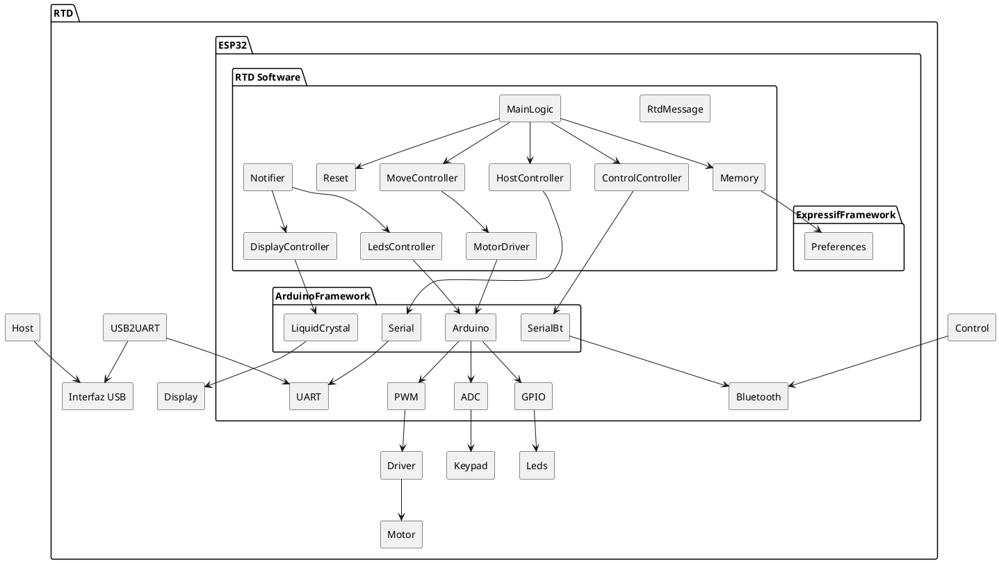

# Alcance de la Versión 1 del Robot de Tracción Diferencial

## Objetivo General

Implementar la primera versión funcional de un robot de dos ruedas con tracción diferencial, controlado por Bluetooth. El objetivo es que el robot pueda ser controlado desde un dispositivo móvil y que realice movimientos básicos.

## Alcance del Proyecto

### 1. Base del Robot

- **Diseño y construcción** de la estructura física del robot.
- **Integración de motores** para controlar las dos ruedas.
- Asegurar la **estabilidad y funcionalidad básica** del sistema de tracción diferencial.

### 2. Control por Bluetooth

- **Implementación de un módulo de comunicación Bluetooth**:
  - Permitir la conexión y control del robot desde un dispositivo externo.
  - **Desarrollo de una aplicación básica** o utilización de una app existente para enviar comandos de movimiento:
    - Adelante
    - Atrás
    - Giro a la izquierda
    - Giro a la derecha

### 3. Software de Control

- **Programación del microcontrolador**:
  - Gestión de los comandos recibidos vía Bluetooth.
  - Implementación de un **algoritmo básico de control de movimiento**.

### 4. Pruebas y Validación

- **Pruebas de funcionamiento**:
  - Realizar test para validar tanto el software como hardware.
  - Validar que el robot responda adecuadamente a los comandos.
  - Asegurar que el robot pueda operar en un entorno controlado.
- **Documentación**:
  - Registro de las pruebas realizadas y los resultados obtenidos.

## A Futuro

### Sensores
- **Integración de sensores básicos**:
  - Un **sensor de distancia** para detección de obstáculos.
- **Programación de un comportamiento simple**:
  - Detenerse o girar al detectar un obstáculo.

## Diseño

- Un módulo de software puede ser funciones agrupadas en una definición .h con
  su implementación en un archivo .c, o una clase declarada en un .hpp y
definida en un .cpp.
- Cada módulo debe proveer una función `<modulo>_setup(<modulo>_cfg_t *cgf)`
  que inicializa la lógica y una función `<modulo>_loop()` que corresponde al
hilo de ejecución del módulo. `<modulo>` debe ser reemplazado por el nombre del
componente controlado, por ejemplo, `leds_setup(leds_cfg_t *cfg)`. El módulo
puede proveer todas las funciones adicionales que considere necesarias.
- La función `<modulo>_setup(<modulo>_cfg_t *cfg)` puede esperar un valor
  `NULL` si el módulo no cuenta con configuraciones posibles.
- La función `<modulo>_loop()` debe realizar las tareas correspondientes al
  módulo. Si no tiene tareas, como en el caso del módulo de leds, la función
puede no realizar ninguna tarea.

### Diagrama de Bloques

