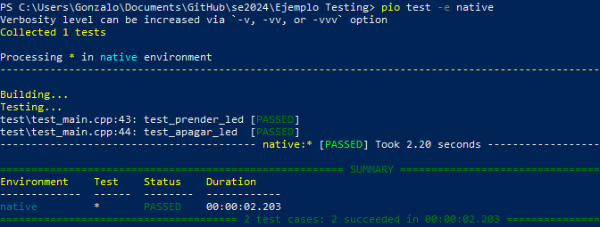

# Guía de Instalación de PlatformIO en VS Code y Configuración de Proyecto para ESP32 con Pruebas Unitarias

## Instalación de PlatformIO en VS Code

1. **Instalar VS Code**:
   - Si aún no tienes Visual Studio Code, descárgalo e instálalo desde la [página oficial de VS Code](https://code.visualstudio.com/).

2. **Instalar Compilador C/C++**:
   - Si aún no tienes un compilador de C/C++, puedes instalarlo de la siguiente manera segun tu sistema operativo.
      - Linux:
      ```
      sudo apt update
      sudo apt install build-essential
      sudo apt-get install gcc
      ```
      - Windows: descárgalo e instálalo desde el [siguiente link](https://drive.google.com/file/d/1_4IRacEYaBLYkAZ5NTTd3yoFPJzcHFEL/view?usp=drive_link). 
Se deben agregar las siguientes rutas en la variable de entorno _PATH_
      ```
      C:\msys64\mingw64\bin
      C:\msys64\ucrt64\bin
      C:\msys64\usr\bin
      ```

3. **Instalar la extensión de PlatformIO**:
   - Abrir VS Code.
   - Ir a la pestaña de **Extensiones** en la barra lateral izquierda o presionar **"Ctrl+Mayus+X"**.
   - Buscar **"PlatformIO IDE"** y seleccionar la extensión creada por PlatformIO. Hacer clic en **Instalar**.
   - Esperar a que la instalación finalice y PlatformIO estará disponible en la parte inferior de la barra lateral izquierda.
   - Luego reiniciar **VS Code**.

## Crear un Proyecto para una Placa ESP32

1. **Crear un nuevo proyecto**:
   - Hacer clic en el icono de PlatformIO en la barra lateral.
   - En la parte superior del panel de PlatformIO, hacer clic en **New Project** lo cual abrira una ventana emergente.
   - Escribir el **Nombre del Proyecto**.
   - En **Board** seleccionar la placa **ESP32** en el menú desplegable, como por ejemplo `esp32dev`.
   - En **Framework** seleccionar **Arduino** o **ESP-IDF** (dependiendo de tu preferencia de desarrollo).
   - En **Directorio de almacenamiento del proyecto** eligir el lugar donde deseas guardar el proyecto.
      _(Procurar que la ruta de almacenamiento no tenga espacios en blanco)_
   - Hacer clic en **Finish**.

   PlatformIO generará un proyecto para la placa ESP32 con la siguiente estructura.
   - Archivo `platform.ini` contiene la configuracion esencial del proyecto.
   - `src/`: archivos de código fuente.
   - `include/`: de ser necesarios, los archivos de cabecera(*.h).
   - `test/`: script/s con las pruebas a realizar.
   - `lib/`: librerias externas a utilizar. 

## Configurar Pruebas Unitarias

Probar el código de manera modular.

1. **Añadir configuración de pruebas unitarias**:
   - Abre el archivo `platformio.ini` en la raíz de tu proyecto.
   - Agrega la siguiente configuración para habilitar las pruebas unitarias:

   ```ini
   ; Configuración para pruebas unitarias
   [env:test]
   platform = native
   board = esp32dev
   framework = arduino
   ```

2. **Crear pruebas unitarias**:
   - Dentro de la carpeta `test/` crear un archivo de prueba. Por ejemplo, `test_main.cpp`.
   - En este archivo implementar las funcionalidades que se desean testear.
   - Por defecto se debe implementar la funcion `void setup(void)` la cual se ejecutara al principio de la prueba, esta funcion se puede utilizar para inicializar variables e invocar otras funciones mediante la sentencia `RUN_TEST(``nombre_funcion``)`.
   - En el archivo `platformio.ini` se debe agregar la linea `platform = native`, y luego en la consola de VSCode ejecutaremos el comando `pio test -e native`, esto compilara y ejecutara en el SO la funcion `main()`_(1)_ de todos los archivos(C/C++) que se encuentren en la carpeta `test/`.

   **_(1)La funcion main() debe inicializar el entorno de Unity y finalizarlo, con las funciones `UNITY_BEGIN()` y `UNITY_END()`._**

 
