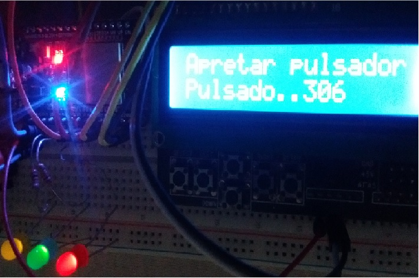

# **Interfaz de usuario**

Para la interacción entre el usuario y el robot usaremos los siguientes componentes:

- Un teléfono que nos permita conectar el bluetooth de placa esp32 con el bluetooth del teléfono.
- Un display LCD1602 Key Shield 1.0 que nos permita ver los mensajes necesarios.
- Tres leds que nos indicarán diferentes situaciones del robot.
- Una llave que desconecte los motores cuando no se estén usando.
- Una fuente de alimentación para darle energía al robot.
- Un pulsador que configure el bluetooth.  

## Uso del teléfono:

El teléfono se emparejará con la placa esp32 a través de una app compatible con Android 6.0 o superior. 
La app ofrecerá la posibilidad de que el robot circule hacia delante, atrás, a derecha , a izquierda y parar.

## Uso del display:

El display ofrecerá los mensajes que indicará si la placa está conectada con el teléfono a través del bluetooth y si esta circulado en alguno de los sentidos o si está detenido.

## Uso de los leds:

Existirán tres colores de leds que indicarán si el robot está circulando en alguno de los sentidos o está detenido. 
El led de color verde indicará que el robot está listo para recibir ordenes.
El led de color amarillo indicará que el bluetooth esta emparejado.
El led de color rojo indicará que se está enviando señal a los motores.

## Uso de la llave:

La llave permitirá prender y apagar el robot.

## Uso de la fuente de alimentación :

Para poder funcionar el robot utilizará una fuente de alimentacion de 5V. con salida tipo micro USB 2.0.

## Uso del pulsador:

Para poder resetear el bluetooth y definir una nueva conexión se utilizará un pulsador.

Un bosquejo de los elementos que se utilizaran se pueden ver en la siguiente imágen:  
 

